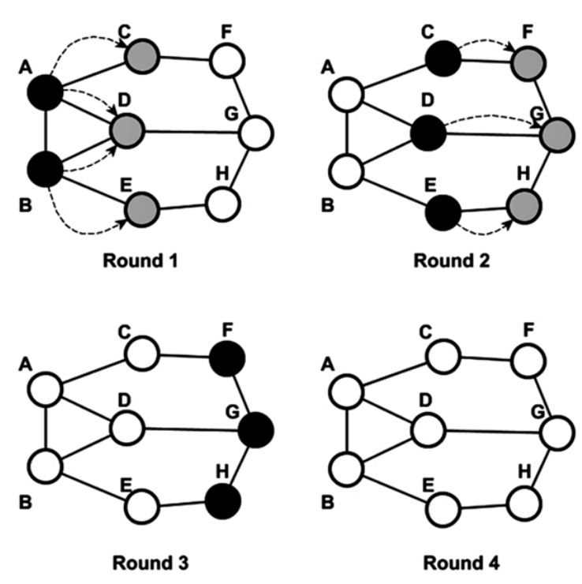
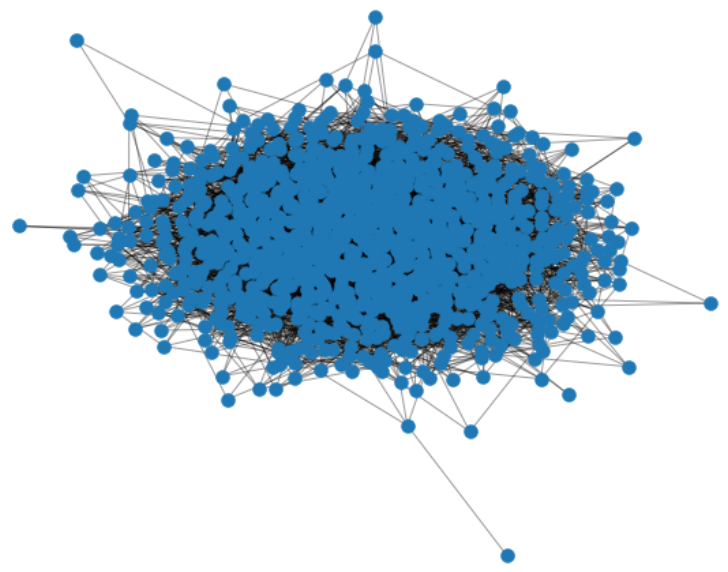

# 信息的扩散

## 1. 现实网络

### 1.1. 分类

现实世界中的网络可分为以下四大类型：

- 信息网络（information networks）：一类人造的网络，其中数据项目以某种方式连接在一起。最著名的例子是万维网（WWW）。一个网络，其中顶点代表由文字、图片组成和其他信息的网页。从一个页面到另一个页面的导航是通过使用代表边的超链接。也包括电子邮件通信、社交网站、网络日志等；

- 技术网络（technological networks）：旨在分配商品或资源的人造网络。最大的例子是互联网（Internet）。其他例子包括电网、交通网络、输送和分配网络以及电话网络；

- 生物网络（biological networks）：表示生物要素之间相互作用模式的网络。例子包括：（1）生物化学网络：表示生物细胞中分子水平上的相互作用模式和控制机制的网络。（2）神经网络：连接人脑中的神经元和动物中枢神经系统的网络。（3）生态网络：物种之间的生态相互作用的网络。

- 社交网络（social networks）：其中顶点代表人，边缘代表顶点之间的某种社会互动形式的网络，包括友谊、亲属关系、信息流、疾病爆发等。

- 复杂网络（complex networks）：维基百科将复杂网络定义为具有非常复杂的拓扑特征的网络，即这些特征在简单的网络中不会出现，如网格或随机图，但在真实的图中经常出现。复杂的网络通常有个别单位所拥有涌现的属性。

## 2. 扩散

### 2.1. 要素

扩散（diffusion）是指信息通过相互作用从一个地方扩散到另一个地方的过程。扩散过程主要包括以下三个方面的内容：

1. 发送者：负责发起扩散过程。
2. 接收者：从发送者那里接收扩散信息。一般情况下，接收者的数量多于发送者的数量。
3. 媒介：是指扩散信息从发送者向接收者发送扩散信息的渠道。

从网络的角度看：扩散过程如何交接？事实上，社会关系起着重要作用。特别是，人与人之间的结构性地位和他们的个人特点使一些人更愿意使用创新（innovation）。

传播始于一个（或几个）使用者（adapter）将创新传播给其他人。创新代表新意，它不等于发明，它既是一个过程，又是一个结果，它涉及到非连续性的变化。那些早期使用的人往往因为创新能力太强，在一个地方网络中的影响力不大。他们沾染了他们的人脉，而这些人脉又沾染了他们的人脉。一个人与人的联系越多，这个人使用这种创新的机会就越大。

在更大的范围内，且，由于社区是相互联系的。一个创新很有可能从一个社区跳到另一个社区（或桥梁），然后重新开始扩散。这是社交网络的一个特点。但，任何扩散过程中，若发现产品（如一个视频、一个音频、一本书等）有问题，需要修复后再重新发布，则任何扩散过程都会被加速、延迟甚至停止。这个过程被称为干预（intervention）。

### 2.2. 传染

传染模型类似于扩散模型，但两者之间有以下一些区别：

- 传染取决于物理上的接近，而不管其他人是否是一个人的社交网络或职业网络的一部分。扩散的情况则不同，它需要一定的社会接触或影响力才能扎根。
- 传染模型不涉及决策等过程，被认为是一个随机的自然过程。在扩散模型中，通常会涉及到扩散决策。例如，当一个谣言正在传播时，收到这个谣言的一组个体会决定是否有兴趣将其传播给邻居。

### 2.3. SIR 模型

Kermack 和 McKendrick 于 1932 年首次提出的易感-感染-康复（susceptible-infected-recovered，SIR）模型是连续时间流行病模型中最常用的一类。SIR 模型被成功地用于大型真实网络，以探索基础网络的结构如何影响扩散过程。

- 易感（S）：尚未感染，但有可能感染该病；
- 感染（I）：染上了该病，具有传染性；
- 康复（R）：不再具有传染性或不易再感染；

```python
def spreading_init( g ):
    for i in g.nodes.keys():
        g.nodes[i]['state'] = 'S'

def spreading_seed( g, pSick ):
    for i in g.nodes.keys():
        if(random.random() <= pSick):
            g.nodes[i]['state'] = 'I'

def spreading_make_sir_model( pInfect, pRecover ):
    # model (local rule) function
    def model( g, i ):
        if g.nodes[i]['state'] == 'I':
        # infect susceptible neighbours with probability pInfect
            for m in g.neighbors(i):
                if g.nodes[m]['state'] == 'S':
                    if random.random() <= pInfect:
                        g.nodes[m]['state'] = 'I'
            # recover with probability pRecover
            if random.random() <= pRecover:
                g.nodes[i]['state'] = 'R'
    return model

def spreading_step( g, model ):
    for i in g.nodes.keys():
        model(g, i)

def spreading_run( g, model, _iter):
    for i in range(_iter):
        spreading_step(g, model)
```

这个模型包括三个部分：相互连接的节点，疾病的传播路径，以及这些节点被感染后恢复的方式。在任何一个时间步，只有被感染的节点才能感染任何一个处于疾病易感状态的相邻节点，这些节点在一定的概率$β$的情况下，才会感染到疾病。在该时间步之后，之前处于感染状态的节点以概率$α$移动到恢复状态，不再能够感染其他节点或被感染。



关于 SIR 模型的功能，我们应该考虑到一些属性：

- SIR 模型不考虑易感性的程度，也不考虑是什么使一些人更容易或更不容易感染疾病。这意味着，一个人要么是易感的，要么是不易感的。
- 这个模型中包含的过程是确定性的（相对于随机的），这意味着这个模型假设任何易感者接触到感染的人也会被感染。这个假设在现实生活中并不太现实，因为与其他一些人相比，有些人对疾病的抵抗力更强，而另一些人的遗传基因更容易生病。另外，疾病的传播速度不同，个体对疾病的接触程度也不同。

> 在易感-感染-恢复-易感（susceptible-infected-recover-susceptible，SIRS）模型中，个体易感，患病，恢复，享受一段免疫期，最后再次易感。

```python
n = 1000
er = nx.erdos_renyi_graph(n, 0.01)

_, ax = plt.subplots()

ax.grid('off')
ax.axis('off')

pos = nx.spring_layout(er, iterations = 50, k = 2/np.sqrt(n))
nx.draw_networkx_edges(er, pos, width = 1, alpha = 0.4)
nx.draw_networkx_nodes(er, pos, node_size= 100, alpha = 1, linewidths = 0.5)

spreading_init(er)
spreading_seed(er, 0.05)
model = spreading_make_sir_model(0.3, 0.05)
spreading_run(er, model, 100)
infected = [ v for (v, attr) in er.nodes(data = True) if attr['state'] == SPREADING_RECOVERED ]
print(float(len(infected)) / n)
# 0.994
```


