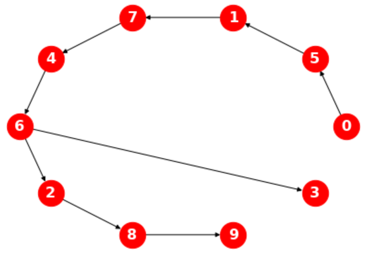
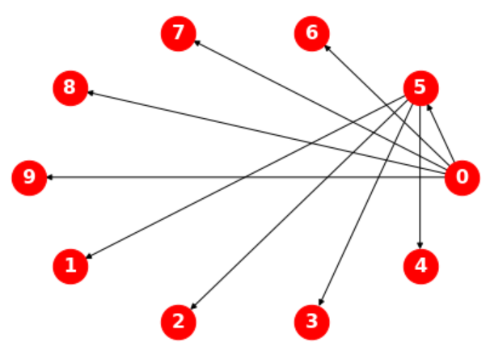

# 图

## 1. 图的组成

### 1.1. 图与网络

图（graph）是描述对象之间关系的数学表示，它包含离散的互连对象。对象由顶点（vertice）或节点（node）表示，互连由边（edge）表示。

一个有一组顶点$X$和一组边$E$的图$G$可写成$G= (X, E)$。设在$G = (X, E)$中，$x, y ∈ X$。距离$d(x, y)$是$(x, y)$最短路径的长度。若$G$中不存在这样的路径，则$d(x, y) = ∞$。在这种情况下，$G$是断开的。$G$的直径，用$diam(G)$表示，是指相距最远的两个顶点之间的距离。两个顶点，即$\max_{x, y ∈ X} d(x, y)$。

从社会学上讲，网络（netwok）是行为体（actor）之间的一组关系。行为体可指个人、团体、组织、国家等。网络中的行为体之间可能有关系，也可能没有关系。网络中节点之间的关系称为边（edge）或纽带（tie）。

一个边可有多种含义。例如，它可意味着与人之间的亲属关系。亲情、恩怨情仇、人情往来。边可有方向性。诸如认识、亲属等关系通常是没有方向性的，而创造通常是有方向的。

### 1.2. 游走

游走（walk）是一个顶点和边的交替序列，其中每条边均是连接前面的顶点和后面的顶点。简而言之，游走是一个链接（link）的列表，这些链接按顺序连接起来形成一个连续的路线（route）。游走以一个顶点为起点，以一个顶点为终点。有以下三种常见形式：

1. 踪迹（trail）：指不经过同一链接多次的游走。
2. 途径（path）：指不经过同一顶点不止一次的游走。
3. 循环（cycle）：指起止于同一顶点，但不经过同一顶点的游走。

### 1.3. 顶点、度

顶点是所有图形的核心元素。它们有以下几个共同点特性：

- 在一个图$G = (X, E)$和一个顶点$x ∈ X$中：从$G$中删除$x$意味着从集合$X$中删除$x$，并删除所有包含$x$的边，但删除一条边比删除一个顶点容易，因为删除一条边只需要边缘从边缘列表中删除。
- 给定顶点$x$的邻域用$N(x)$表示。入射到顶点$x$的边集用$E(x)$表示。
- 由一条边连接的两个顶点称为其端点（endpoint）。边被描述为与顶点的事件。
- 切割顶点（cut-vertex）是若去掉网络组件的数目增加的顶点。顶点分离器（vertex-separator）是若将其移除，则图中的将被拆解成小的组件的顶点集合。
- 标记的顶点（labeled vertex）是与一个值相关联的顶点。
- 弧（arc）：一个有序的顶点对。若$(x, y)$是一个弧，则$x$被称为初始顶点，$y$被称为终点顶点。

度与顶点的关系如下：

- 度（degree）是指顶点的所带的边数，用$d(x)$表示。在有向图中，出度（out-degree）是流出的边数，而入度（in-degree）是输入的边数。
- 孤立顶点（isolated vertex）是度为零的顶点。源顶点（source vertex）是入度为零的顶点，而沉没顶点（sink vertex）是出度为零的顶点。

### 1.4. 边

- 闭环（loop）：将一个顶点与自身连接起来的边。
- 平行（parallel）：连接两个顶点的多条边。也称为多重（multiple）。

## 2. 图的生成

### 2.1. 按照组成

- 无向图（undirected graph）：边没有方向的图，这种图通常用于代表对称的链接。这种图通常代表关系是相互的，无向图可很轻松的向有向图变换。
- 有向图（directed graph）：也叫双向图（digraph），指节点之间的边有方向的图，这种情况下，图里的节点的关系是不对称的。
- 权重图（weighted graph）：具有与边相关联的实值权重的图。边的权重可代表一个概念，如连接成本、长度、容量、相似度、距离等，这取决于该图的具体用途。
- 平面图（planar graph）：平面图是在二维平面里面的没有边相互相交的图，如电路图。
- 正交图（orthogonal graph）：一个包括水平线和垂直线的图。
- 网格图（grid-based graph）：图里的节点和边被放置在二维网格中。

### 2.2. 按照排布

- 简单图（simple graph）：无定向图，任何两个顶点之间没有闭环或多边连接，每一条边连接一对不同的顶点。
- 正则图（regular graph）：每个顶点具有相同数量的邻居的图，各顶点的度均为$k$的正则图称为 k-正则图。
- 环形晶格（ring lattice）：是一种$k$为偶数的正则图，在具有$n$个顶点的环形晶格中，顶点可排列成圆形，每个顶点连接$k$个最近邻居。
- 完全图（complete graph）：指任意一对顶点均相连的图。
- 混合图（mixed graph）：图中一些边是定向的，其他边是无定向的。有向图和无向图是其特殊情况。
- 多图（multigraph）。指使用多边或闭环的图。
- 半边图（Half-edges graph）：也叫松边图（loose edges graph），是指只有一端的图。
- K-连接图（K-connected graph）：有$k-1$个顶点（或）没有断开连接的图。
- 弱连通图（weakly connected graph）：将所有的有方向的边都用无方向的边替换的图。反之为强连通图（strongly connected graph）。

## 3. 图的遍历

### 3.1. 深度优先

深度优先搜索（depth-first search，DFS）是一种无信息搜索技术，它系统地遍历节点，直到找到目标。该算法向下遍历一个子节点的子节点，然后回溯到它的每个兄弟姐妹，最后产生一个它所访问过的节点的遍历树。其中，使新发现的节点的边被保留为"发现边"（discovery edges），而用于回溯的边被保留为"回溯边"（back edges）。


```python
g = nx.barabasi_albert_graph(10, 5)

tree = nx.dfs_tree(g, 0)
print(list(tree.edges()))
# [(0, 5), (5, 1), (1, 7), (7, 4), (4, 6), (6, 2), (6, 3), (2, 8), (8, 9)]
successors = nx.dfs_successors(g, 0)
print(successors)
# {0: [5], 5: [1], 1: [7], 7: [4], 4: [6], 6: [2, 3], 2: [8], 8: [9]}
predecessors = nx.dfs_predecessors(g, 0)
print(predecessors)
# {5: 0, 1: 5, 7: 1, 4: 7, 6: 4, 2: 6, 8: 2, 9: 8, 3: 6}

draw(tree)
```



### 3.2. 广度优先

广度优先搜索（breadth-first search，BFS）通过寻找从单个源顶点到同一网段中的每个其他顶点的最短路径来遍历网络。它涉及到迭代遍历当前壳（shell）中所有节点的邻居，并将所有尚未访问过的后续邻居加入到下一个壳中。通过这种方式，该算法可计算出两个节点之间的最短距离。若两个节点之间有一条以上的地理路径，只要稍加修改，就可发现。

BFS 应用于寻找最短路径的方法如下：当只知道"s"与自己的距离为 0，而与其他所有顶点的距离是未知的。接下来，找到"s"的所有邻居，根据定义，这些邻居与"s"的距离为 1，然后找到这些顶点的邻居。排除那些已经访问过的顶点，这些顶点必须与"s"的距离为 2，且他们的邻居，除了已经访问过的邻居外，都有距离"3"，以此类推。

```python
tree = nx.bfs_tree(g, 0)
print(list(tree.edges()))
# [(0, 5), (0, 6), (0, 7), (0, 8), (0, 9), (5, 1), (5, 2), (5, 3), (5, 4)]
successors = nx.bfs_successors(g, 0)
print(dict(successors))
# {0: [5, 6, 7, 8, 9], 5: [1, 2, 3, 4]}
predecessors = nx.dfs_predecessors(g, 0)
print(predecessors)
# {5: 0, 1: 5, 7: 1, 4: 7, 6: 4, 2: 6, 8: 2, 9: 8, 3: 6}
draw(tree)
```



## 4. 相关应用

### 4.1. 旅行商问题

旅行商问题（traveling salesman problem，TSP）：设有一个旅行商人要拜访$n$个城市，他必须选择所要走的路径，路径的限制是每个城市只能拜访一次，且，最后要回到原来出发的城市。路径的选择目标是要求得的路径路程为所有路径之中的最小值。


