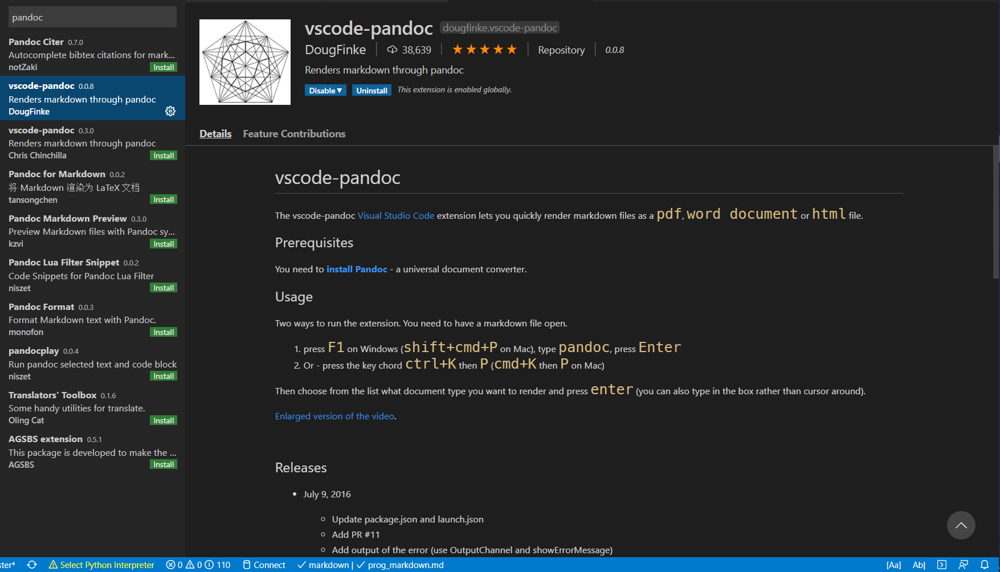

# 搭建 Markdown 舒适写作环境（VS Code）

## 1. Markdown 编写环境概览

Markdown 是一种易于读写的轻量级的标记语言，编写出的作品简洁美观，近年来受到了越来越多的追捧，被广泛地用于日常写作，乃至电子书发表。与此同时，一系列优秀 Markdown 编辑器应运而生。其中较为著名的有，Typora（免费，跨平台）、MarkText（开源，跨平台）、Zettlr（开源，跨平台）、Mou（免费，MacOS）、MacDown（开源，MacOS）等等。

VS Code 是当下最流行的代码编辑器，拥有丰富的扩展，这也使其成为最强大的文本编辑器之一（拒绝伤害 Vim 党人及 Emacs 党人），搞定 Markdown 自然不在话下。与上面提到的编辑器相比，VS Code 的明显优势有：

- 集成的布局：大纲（outline）、工作区（workspace）；
- 强大的补全：LaTeX 公式；
- 丰富的扩展：方便整合其他工具（详见下文的功能扩展部分）；

## 2. 语法扩展

VS Code 默认是支持 Markdown 的，但还是有必装下面 3 个插件提高写作效率。

- Markdown All in One
- Markdown Preview Mermaid Support
- mardownlint

### 2.1. Markdown All in One

如名称所述，这是个大一统型的扩展，集成了撰写 Markdown 时所需要的大部分功能，是 Markdown 类插件中下载榜榜首。可认为是 VS Code 中的 Markdown 必备扩展。其功能涵盖：

- 快捷键自
- 动生成并更新目录
- 自动格式化表格
- LaTeX 数学公式支持


### 2.2. markdownlint

这是个功能强大的 Markdown 语法检查器，可以帮助你书写出规范的文档，同时避免书写错误导致文档无法渲染。个人观点，认为这个也是必装扩展。

## 3. 功能扩展

### 3.1. 导出

Pandoc 是文档格式领域的瑞士军刀，几乎实现了常见文档格式所有变换，像 .docx，.md，.html，.pdf 这些格式更是不在话下。给个其官网部分截图（涉及的格式实在太多，截取三分之一，字就已经特别小了）。


Pandoc 的下载可去官网手动下载

[](https://pandoc.org/)

也可使用包管理器自动下载。

对 Windows 用户，有 Scoop

```powershell
scoop install pandoc
```

对 MacOS 用户，有 Homebrew

```bash
brew install pandoc
```

安装完毕后，在 VS Code 中安装相关扩展，这里首推 vscode-pandoc，可实现 .md 到 .docx 以及.pdf 和.html 的变换。

对于.pdf 的变换，需要在 `settings.json` 中添加：

```json
{
  "pandoc.pdfOptString": "--pdf-engine=xelatex"
}
```

但事实证明，这个并不好用。建议先转.docx，然后再转 .pdf。



### 3.2. 字数统计

这里推荐 Word Count CJK，可对各种字符进行统计，安装扩展后，在 setting.json 中修改

```json
{
  "wordcount_cjk.activateLanguages": ["markdown", "plaintext", "latex"],
  "wordcount_cjk.statusBarTextTemplate": "中文：${cjk} 字 + 英文：${en_words} 词",
  "wordcount_cjk.statusBarTooltipTemplate": "中文字数：${cjk} \\n 非 ASCII 字符数：\\t${total - ascii} \\n 英文单词数：${en_words} \\n 非空白字符数：${total - whitespace} \\n 总字符数：${total}"
}
```

至此，VS Code 已经实现了 Typora 等 Markdown 编辑器除所见即所得（WYSIWYG）之外的全部功能。

### 3.3. 文档绘图

很多时候，写文档难免需要绘制一些用于说明的插图，如流程图、甘特图等，这个时候，若另开一个应用画图，再导入文档，则略显繁琐。前文提到的 MPE 扩展支持的 mermaid.js 可轻松解决这一难题。简单说，mermaid.js 就是一个 Markdown 的绘图工具包，关于其介绍，可参考 Markdown 绘图。

当然，若习惯于图形化的界面，VS Code 现在提供了另一种选择，即大名鼎鼎的 [Draw.io](https://app.diagrams.net/) 的内嵌扩展，安装完毕后三连：➡️ 新建 .drawio 文件 ➡️ 傻瓜绘图 ➡️ 导出为需要的格式。


### 3.4. 知乎发布

WPL/s 继承于 Zhihu On VS Code，可用于 Markdown 在知乎上一键发布，尤其适合存在**大量图片和代码块**的帖子，当然也在 VS Code 里**看帖摸鱼**。有兴趣的可参看其作者的介绍。
