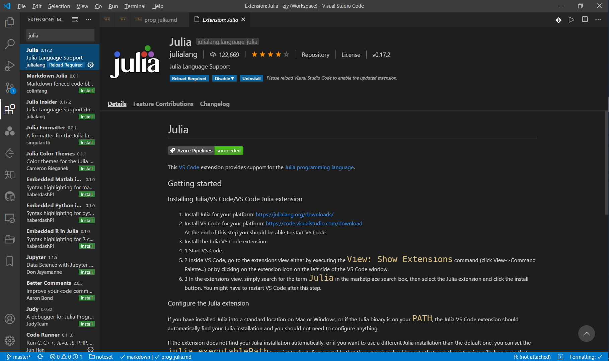
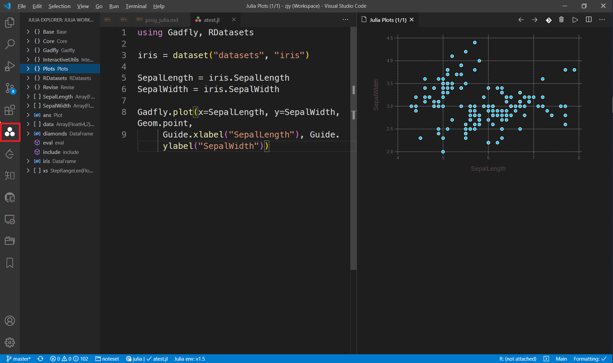

# 搭建 Julia 轻量级编写环境

作为数据科学中的后起之秀，Julia 以其出色的运算速度，受到了不少人媒体的追捧（虽然也不清楚这些写稿的人都用没有）。Julia 致力于成为一个全面的数据科学语言，不过由于社区依然不如 Python 和 R 庞大，经常会有包资源稀缺的情况。就个人体验，Julia 最具优势的还是科学计算，亦为我最需要的，故若做科学计算，这里我首推 Julia，它的 `DifferentialEquations.jl` 比 `SciPy` 好用。其他热门领域诸如机器学习、深度学习、数据分析暂不推荐，静观其变。

> 下面的介绍，以 Julia 1.5 为例。

## 1. 安装 Julia

Julia 安装包的下载可前往 [Julia 官网](https://julialang.org/downloads/)

不过，鉴于官网的速度感人，这里推荐 [Julia 北外镜像](https://mirrors.bfsu.edu.cn/julia-releases/bin/)

接下来便是一路 Next 的安装。

也可使用包管理器完成上述过程，关于包管理器的使用，参见如下两篇文章。

对 Windows 用户，有 Scoop

```powershell
scoop install integzz/scoopet/julia-cn
```

对 MacOS 用户，有 Homebrew

```bash
brew install julia
```

对 Linux 用户，可使用 apt

```bash
sudo apt install julia
```

也可以采用 Linuxbrew 安装（北外镜像，速度更快）

```brew
brew tap integzz/chinese/julia-cn
```

## 2. VS Code 调用 Julia

Julia 团队，曾经力推基于 Atom 的 Juno IDE，但目前已表示弃坑，全面投奔 VSCode。

> 这里说明一下，对 Julia 1.6 以下版本，Jupyter 中启动 Julia 明显更快，因为 VSCode 中，Julia 要编译额外的一下包。Julia 从 1.6 开始，采用了安装完即预编译的机制，故就不存在这方面的差异了。

### 2.1. 安装扩展

在扩展商店，搜索并安装 Julia 扩展即可



安装完毕后，"ctrl"+", " 进入配置，点击右上角的图标，打开配置的 json 文件。

```json
{
  "julia.executablePath": "c:/scoop/apps/julia-cn/current/bin/julia.exe",
  //"julia.executablePath": "usr/local/bin/julia",
  "julia.lint.missingrefs": "symbols",
  "julia.useCustomSysimage": true,
  "julia.execution.resultType": "inline",
  "julia.execution.codeInREPL": true,
  "julia.enableTelemetry": false,
  "julia.enableCrashReporter": false
}
```

### 2.2. 安装包

当然，要想在 VS Code 中调用 Julia，还需安装一个包 `Revise.jl` 。返回 Julia 命令行，进入包管理器

```bash
(@v1.5) pkg> add Revise
```


之后便可编写 Julia 代码，变量会储存在左侧边栏的 Julia Explorer 中，点击空框中的图标即可看到；
生成的图片储存在 Julia Plots 中，查看 `ctrl+shift+p` （或 `command+shift+p` ）打开 Panel，输入 `Julia: Show Plots` 。



## 3. JupyterLab 调用 Julia

Jupyter 是 Julia、Python、R 三种语言缩写的集合，后两者的第三方库的管理可由 Conda 完成，而 Julia 的包的安装仍然需要 Julia 原生的包管理器来完成。

### 3.1. 安装包

安装 `IJulia.jl`

```bash
(@v1.5) pkg> add IJulia
```

退出 Julia，安装 JupyterLab

```bash
conda install -c conda-forge jupyterlab
```

打开

```bash
jupyter lab
```


### 3.2. Jupyter

自定义 Jupyter 路径

```bash
# mac
ENV["JUPYTER"]="/usr/local/Caskroom/miniconda/base/envs/kaggle/bin/jupyter"
# windows
ENV["JUPYTER"]="c:\\scoop\\apps\\miniconda\\current\\envs\\kaggle\\Scripts\\jupyter.EXE"
# linux
ENV["JUPYTER"]="~/miniconda3/envs/kaggle/bin/jupyter"
```

若希望使用已安装的本地 Jupyter，键入如下命令

```julia
using IJulia
IJulia.installkernel("Julia", "--depwarn=no")
```

## 4. Pluto

## 5. 备注

### 5.1. Linux 环境

在 Linux 环境中，为保障 Julia 可视化包的正常运行，还需安装以下包

```bash
# Debian/Ubuntu:
sudo apt install libxt6 libxrender1 libxext6 libgl1-mesa-glx libqt5widgets5
# Arch Linux:
pacman -S mesa qt5-base
```

### 5.2. 调用 Python 库

使用 `PyCall.jl` 可调用 Python 包，但在安装 `PyCall.jl` 前，需指明 Python 的路径。

```bash
# windows
ENV["PYTHON"]="c:\\scoop\\apps\\miniconda\\current\\envs\\kaggle\\python.exe"
# linux
ENV["PYTHON"] = "~/miniconda3/envs/kaggle/bin/python"
```

### 5.3. Julia 包管理

```bash
# 添加
(@v1.5) pkg> add [Package]
# 删除
(@v1.5) pkg> rm [Package]
# 更新
(@v1.5) pkg> update [Package]
# 更新所有
(@v1.5) pkg> update
# 列出安装了的包
(@v1.5) pkg> status
# 编译
(@v1.5) pkg> build [Package]
```
