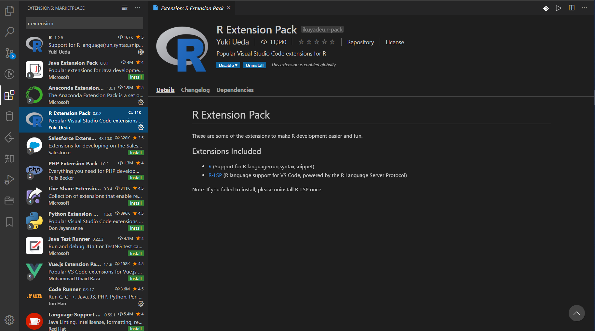
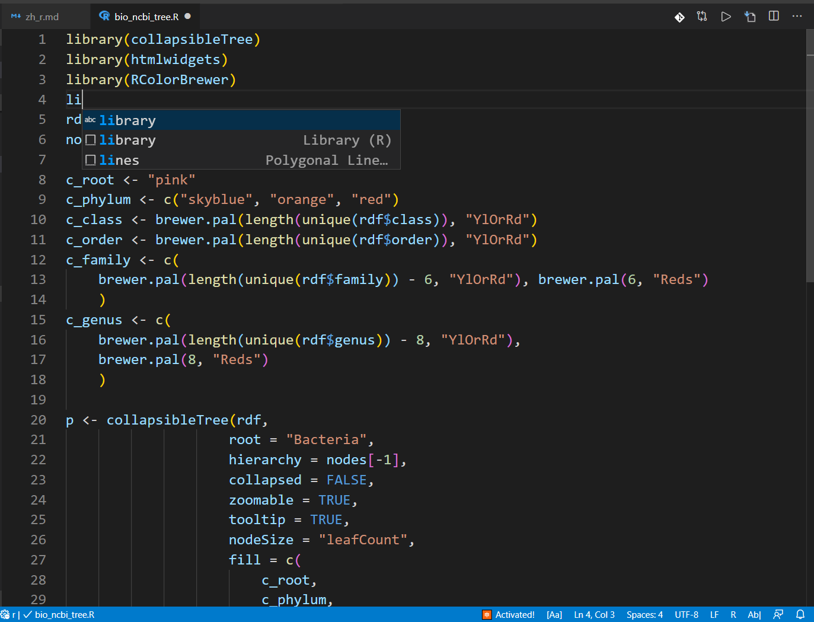

# 搭建 R 编写轻量级环境

## 1. R 语言编写环境概览

众所周知，RStudio 是 R 语言最佳 IDE，集成了 Python、SQL、RMarkdown 等一系列工具，照顾到了数据分析的方方面面。

但，对于平时工作以 Python 为主，R 为辅，同时还使用 Julia 的我来说，VS Code 和 JupyterLab 是更为理想的工作环境。

## 2. VS Code 调用 R

事实上，VS Code 的文件浏览（explorer）和大纲（outline）以及整个工作区的排布（layout）是非常合理和方便的。

需要承认，VS Code 中的 R 扩展还有 2 个重要功能没有实现：

- 变量查看器（variable inspector）
- 逐行交互运行

不过，鉴于 VS Code 的高度可扩展性，这些未来会实现的。

### 2.1. conda 相关库

进入 conda 环境，安装 "r-languageserver" 和 "radian"：

```bash
conda install r-languageserver
pip install radian
```

因为本配置主要针对需要同时使用 R 的 Python 用户，因此具体 conda 是个什么东西，这里就不赘述了，具体介绍见 [Anaconda](https://www.anaconda.com)。

推荐安装其中的 Miniconda 版本，[Miniconda 的清华镜像](https://mirrors.tuna.tsinghua.edu.cn/anaconda/miniconda/)

对于 R 的第三方包的安装，命令格式如下

```bash
conda install r-[package]
# 如安装大名鼎鼎的 ggplot2
conda install r-ggplot2
```

### 2.2. VS Code 扩展

在 VS Code 中的扩展商店里搜索并安装 R Extension Pack



安装完毕后，"ctrl"+", " 进入配置，点击右上角的图标，打开配置的 json 文件。


对 MacOS 加入如下配置：

```json
{
  "r.bracketedPaste": true,
  "r.lsp.debug": true,
  "r.rterm.mac": "/usr/local/Caskroom/miniconda/base/bin/radian",
  "r.rpath.mac": "/usr/local/bin/R",
  "r.rterm.option": [
    // "--no-save",
    // "--no-restore",
    "--no-site-file"
  ]
}
```

对于 Windows 加入如下配置：

```json
{
  "r.bracketedPaste": true,
  "r.lsp.debug": true,
  "r.rterm.windows": "c:/scoop/apps/miniconda-cn/current/scripts/radian.exe",
  "r.rpath.windows": "c:/scoop/shims/r.exe",
  "r.rterm.option": [
    // "--no-save",
    // "--no-restore",
    "--no-site-file"
  ]
}
```

### 2.3. 自定义快捷键

作为一个 Python 用户，有时候挺为 R 语言中的"<-"烦心的。针对这个问题，可在 File-Preference 里的 Keyboard Shortcuts （快捷键是 CTRL+K CTRL+S）调整。在下图界面中点击右上角红框中的按钮，进入 keybindings.json，加入如下语句：

```json
[
  {
    "key": "alt+=",
    "command": "type",
    "args": {
      "text": " != "
    },
    "when": "editorTextFocus"
  },
  {
    "key": "alt+-",
    "command": "type",
    "args": {
      "text": " <- "
    },
    "when": "editorTextFocus"
  },
  {
    "key": "alt+, ",
    "command": "type",
    "args": {
      "text": " %<% "
    },
    "when": "editorTextFocus"
  },
  {
    "key": "alt+.",
    "command": "type",
    "args": {
      "text": " %>% "
    },
    "when": "editorTextFocus"
  }
]
```


### 2.4. 运行效果



## 3. JupyterLab 调用 R

JupyterLab 是一个非常友好的交互环境，通过安装扩展，可方便地进行变量查看，弥补了上文提到的 VS Code 当下的两点不足。

### 3.1. conda 相关库

进入 conda 环境，安装 "r-base" 和 "r-irkernel"：

```bash
conda install r-base r-irkernel
```

若安装完毕，但仍不显示 kernel，则需要在命令行中进入 R，键入如下命令：

```bash
IRkernel:: installspec()
```

### 3.2. JupyterLab 扩展

通过如下命令安装 JupyterLab 扩展，当然也可进入 JupyterLab 后通过扩展商店安装。

```bash
# 扩展管理器
jupyter labextension install @jupyter-widgets/jupyterlab-manager
# 变量查看器
jupyter labextension install @lckr/jupyterlab_variableinspector
```

### 3.3. 运行效果


